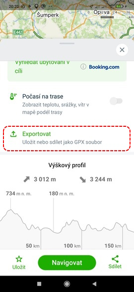
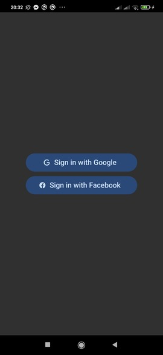
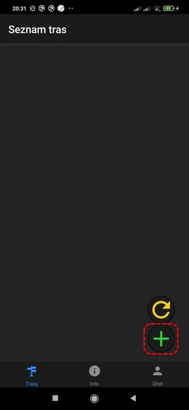
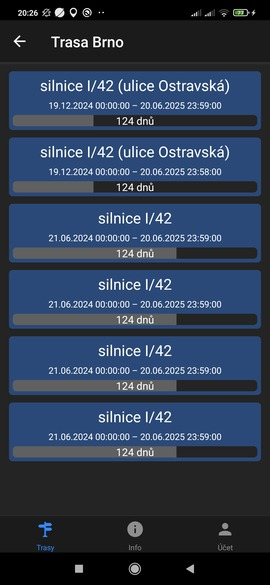
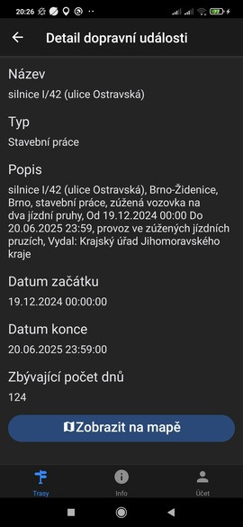

# Traffic Events Informer

Traffic Events Informer (TEI) is a mobile application which notifies you about new traffic events on road, such as traffic accidents, road maintenance etc. It also notifies you when traffic events end. Traffic data are fetched from [Directorate of Roads and Highways of the Czech Republic API](https://mobilitydata.rsd.cz/), therefore TEI is only usable for roads in Czech Republic. The application is suitable for anyone who wants to know what is happening on the roads they regularly drive through. If the driver is notified about a new traffic event, he can choose an alternative route, or he can drive more carefully in the section where the traffic event is taking place.

## How to use

In order for the application to be usable, it is necessary to import a file with route coordinates first. You can get this file from [mapy.cz](https://mapy.cz/) web page or from their [mobile application](https://play.google.com/store/apps/details?id=cz.seznam.mapy) (screenshots below were taken from mobile application). To get the application up and running, follow these steps:

1. Enter your route to mapy.cz

2. Export the route. Make sure the checkbox is checked or else the route won't be imported successfully.

3. Sign in to TEI via your Google or Facebook account

4. Tap add route button

5. Select the route and import it

6. Browse traffic events in imported route.

7. Tap on traffic event to see detailed info.

